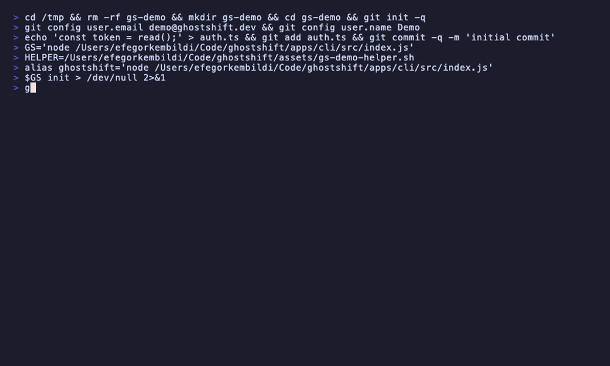
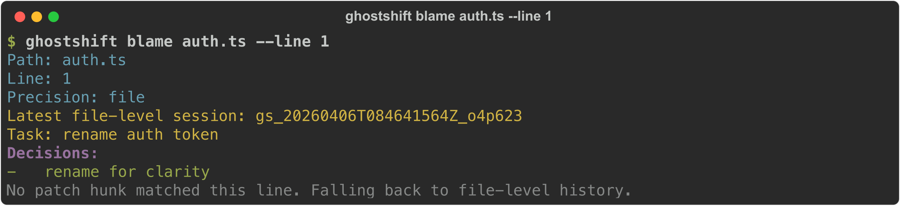
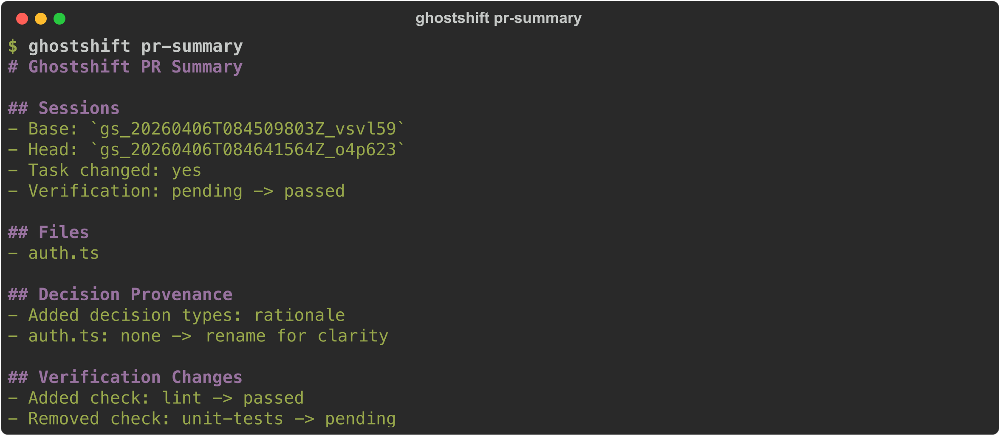
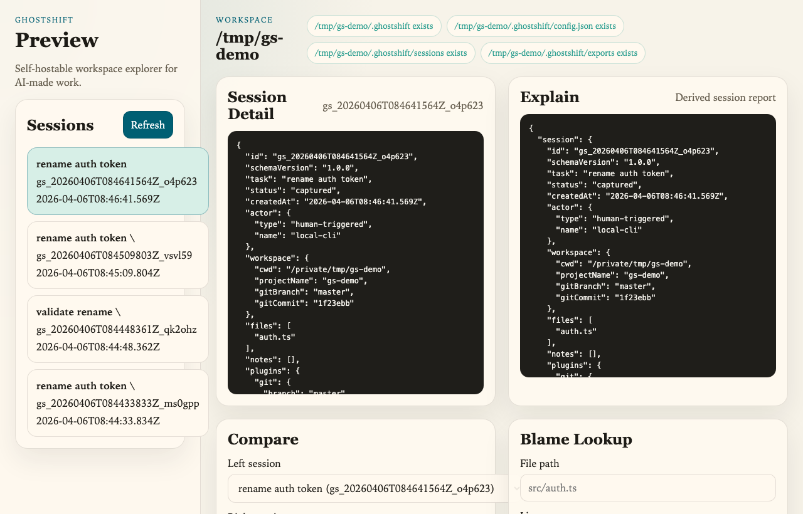

<div align="center">

<h1>Ghostshift</h1>

<p><strong>The missing audit trail for AI-made work.</strong></p>
<p><code>git</code> tells you what changed.<br/>Ghostshift tells you <em>why</em> an agent made the change, what task it belonged to, and how to replay it later.</p>

[](LICENSE)
[](LICENSES)
[](https://nodejs.org)
[](docs/release-notes-v1.0.0.md)

<br/>



</div>

---

## Why Ghostshift?

AI agents produce commits, but the reasoning — the task context, decisions made, checks run — disappears the moment the agent finishes. Ghostshift captures that layer:

- **Capture** — record tasks, touched files, decisions, and verification results alongside every agent session
- **Blame** — find which session changed a specific file or line, and what decision went with it
- **Explain** — get a semantic summary of what a session did and why
- **Replay** — create a new session linked to an earlier one for auditability
- **Compare** — diff two sessions: verification changes, decision provenance, patch deltas
- **Export** — emit a stable, open JSON payload for external tooling or archival
- **Self-host** — browse all of the above in a local preview UI, no cloud required

---

## Install

```bash
npm install -g ghostshift
```

Node 20+ required. No other dependencies.

---

## Quickstart

```bash
# 1. Initialize in your project
ghostshift init

# 2. Record a task with decisions and verification
ghostshift run "refactor auth middleware" \
  --files src/auth.ts,src/session.ts \
  --decision "rationale:split auth checks from session loading" \
  --decision "risk:avoid changing token parsing in this pass" \
  --verify "lint:passed" \
  --verify "unit-tests:pending:needs fixture coverage"

# 3. List sessions
ghostshift trace

# 4. Find who changed a line
ghostshift blame src/auth.ts --line 42
```

See [docs/quickstart.md](docs/quickstart.md) for the full walkthrough.

---

## CLI Reference

| Command | What it does |
|---|---|
| `init` | Create `.ghostshift/` and local config |
| `run <task>` | Record a task session with files, decisions, and checks |
| `trace` | List all captured sessions |
| `blame <file> [--line N]` | Find sessions that touched a file or specific line |
| `explain <id>` | Summarize why a session happened and what it touched |
| `verify <id>` | Show verification state for a session |
| `replay <id>` | Create a new session linked to an earlier one |
| `compare <left> <right>` | Diff two sessions |
| `pr-summary [left] [right]` | Generate a Markdown PR summary |
| `export` | Emit a stable JSON payload of all session data |
| `doctor` | Validate config and storage |

### Blame — line-aware attribution



### PR Summary — ready for automation



---

## Self-Host Preview

Start a local browser UI over any workspace that contains `.ghostshift/`:

```bash
npm run preview
# or: GHOSTSHIFT_WORKSPACE=/path/to/repo node apps/server/src/index.js
```



The preview exposes session detail, explain reports, compare views, line-aware blame lookup, and export import/sync — all without a cloud dependency.

---

## Plugins

Ghostshift ships a stable plugin API with four hook types:

| Hook | Purpose |
|---|---|
| `captureSession` | Enrich a session at capture time |
| `enrichPatch` | Add semantic metadata to a diff |
| `reportVerification` | Push verification results to external systems |
| `consumeExport` | Process the stable export payload |

Built-in adapters: **`git`**, **`shell`** (enabled by default).

Load a local plugin by path:

```json
{
  "plugins": {
    "enabled": ["git", "./ghostshift-plugin.mjs"]
  }
}
```

See [docs/architecture/plugins.md](docs/architecture/plugins.md) for the full adapter contract.

---

## Stable Export

`ghostshift export` emits a versioned JSON payload with:

- raw `sessions`
- derived `reports` (verification summary, patch summary, semantic summary, provenance summary, replay lineage)
- plugin catalog and plugin-produced export sections
- explicit `exportVersion` and capability metadata

See [docs/spec/export-format.md](docs/spec/export-format.md) for the exact shape.

---

## PR Summary Flow

```bash
# From latest two sessions
ghostshift pr-summary

# Between specific sessions, written to a file
ghostshift pr-summary gs_base gs_head --output ghostshift-pr-summary.md
```

See [examples/github-action/README.md](examples/github-action/README.md) for the GitHub Actions workflow example.

---

## Repository Layout

```
apps/
  cli/        npm CLI entrypoint
  server/     self-host preview HTTP server
  ui/         static preview web UI
packages/
  core/       task and session orchestration
  plugins/    stable plugin runtime and official adapters
  spec/       open data shapes and schema versioning
  storage/    local storage adapters
docs/
  architecture/
  rfcs/
  spec/
examples/
  local-repo/
  github-action/
```

---

## License

Product packages are `AGPL-3.0-only`. The spec and future SDK packages are `Apache-2.0`. The rationale is in [docs/rfcs/0001-monorepo-and-oss.md](docs/rfcs/0001-monorepo-and-oss.md).

---

## Contributing

See [CONTRIBUTING.md](CONTRIBUTING.md) and [GOVERNANCE.md](GOVERNANCE.md). New contributors should start with the [quickstart](docs/quickstart.md) and the [RFC process](docs/rfcs/).
